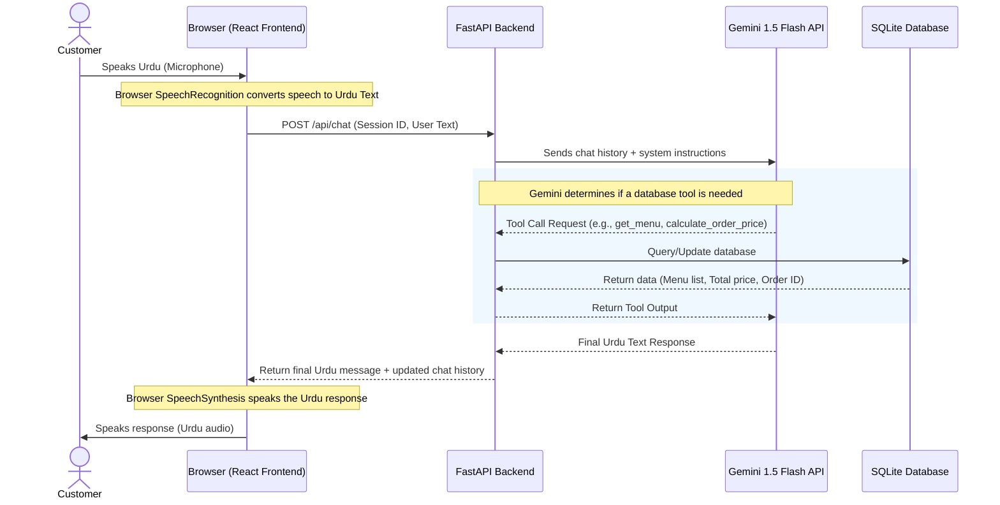

# Karachi Bites AI Restaurant Voice Agent

This project is a fully functional MVP of an **AI-Powered Voice Agent** ("Bhai") designed for a Pakistani restaurant called **Karachi Bites**. It enables customers to place orders using natural Urdu or an Urdu-English mix (Roman Urdu). 

The system leverages the browser's native **Speech Recognition (STT)** and **Speech Synthesis (TTS)**, a **FastAPI backend** powered by **Gemini 1.5 Flash** with function/tool calling, and a local **SQLite database** to store menus, orders, call logs, and call recordings.

---

## 🛠️ System Architecture

The following diagram illustrates how the frontend and backend communicate to handle customer orders:



---

## 📋 Key Functionality

1. **Natural Urdu Voice Interaction**: Customers can speak in Pakistani Urdu, and the agent responds in spoken Urdu.
2. **Real-time Voice to Text**: Utilizes the browser's native `SpeechRecognition` API (configured for `ur-PK`).
3. **OpenAI-like Tool Calling**: Gemini 1.5 Flash detects user intent and calls backend tools to query the menu, calculate prices, and save orders without hallucinating.
4. **Order Calculation & Validation**: Menu prices and totals are calculated entirely by the backend database tools to ensure accuracy.
5. **Order Dashboard**: A real-time React dashboard where administrators can view incoming orders, order items, and delivery details.
6. **Call Logs & Transcripts**: A dedicated dashboard tab to view complete conversation histories and transcriptions.
7. **Call Recording**: Records customer calls as `.webm` files and uploads them to the server for playback.

---

## 📂 Project Structure

- **[verify_setup.py](file:///c:/Users/Latitude%20E7470/Desktop/voice%20agent/verify_setup.py)**: A helper script to verify database creation and seed the menu.
- **[backend/](file:///c:/Users/Latitude%20E7470/Desktop/voice%20agent/backend)**: The FastAPI server.
  - **[main.py](file:///c:/Users/Latitude%20E7470/Desktop/voice%20agent/backend/main.py)**: Endpoints, Gemini integration, and database tool execution.
  - **[database.py](file:///c:/Users/Latitude%20E7470/Desktop/voice%20agent/backend/database.py)**: SQLAlchemy configuration.
  - **[models.py](file:///c:/Users/Latitude%20E7470/Desktop/voice%20agent/backend/models.py)**: DB Schemas (Menu, Order, OrderItem, CallSession).
  - **[seed.py](file:///c:/Users/Latitude%20E7470/Desktop/voice%20agent/backend/seed.py)**: Populates the restaurant's menu with default items and prices.
  - **[requirements.txt](file:///c:/Users/Latitude%20E7470/Desktop/voice%20agent/backend/requirements.txt)**: Python package dependencies.
  - **[.env](file:///c:/Users/Latitude%20E7470/Desktop/voice%20agent/backend/.env)**: Holds the Gemini API key and SQLite path.
- **[frontend/](file:///c:/Users/Latitude%20E7470/Desktop/voice%20agent/frontend)**: The React single-page dashboard app.
  - **[src/App.tsx](file:///c:/Users/Latitude%20E7470/Desktop/voice%20agent/frontend/src/App.tsx)**: Main application layout, dashboard, chat log, and state management.
  - **[src/voice.ts](file:///c:/Users/Latitude%20E7470/Desktop/voice%20agent/frontend/src/voice.ts)**: Implements browser speech-to-text, text-to-speech, and media recorder.
  - **[vite.config.ts](file:///c:/Users/Latitude%20E7470/Desktop/voice%20agent/frontend/vite.config.ts)**: Configures a proxy server pointing `/api` traffic to port 8000.
  - **[package.json](file:///c:/Users/Latitude%20E7470/Desktop/voice%20agent/frontend/package.json)**: Node.js dependencies.

---

## ⚙️ Setup & Installation

### Prerequisites
- **Python 3.10+** (Ensure it is added to your PATH)
- **Node.js 18+** (with npm)
- **Google Gemini API Key**: Obtain one from [Google AI Studio](https://aistudio.google.com/).

---

### Step 1: Configure Backend Environment Variables
Open the **[backend/.env](file:///c:/Users/Latitude%20E7470/Desktop/voice%20agent/backend/.env)** file and make sure it has your API key:
```env
GEMINI_API_KEY=YOUR_GEMINI_API_KEY
DATABASE_URL=sqlite:///./karachi_bites.db
```

> [!NOTE]
> If `GEMINI_API_KEY` is not set or is empty, the application will run in **Demo Mode**, returning pre-defined mock Urdu greeting responses but without active AI dialog logic.

---

### Step 2: Set Up Python Virtual Environment & Install Dependencies
From the root workspace directory, run the following commands in PowerShell or Command Prompt:

1. Create a Python virtual environment:
   ```bash
   python -m venv venv
   ```
2. Activate the virtual environment:
   - **Command Prompt (cmd):**
     ```cmd
     venv\Scripts\activate.bat
     ```
   - **PowerShell:**
     ```powershell
     .\venv\Scripts\activate
     ```
3. Install backend dependencies:
   ```bash
   pip install -r backend/requirements.txt
   ```

---

### Step 3: Seed & Verify Database
Run the setup verification script to create database tables and seed the Karachi Bites menu items:
```bash
python verify_setup.py
```
This should output:
```text
Imports successful!
Database tables created!
Seeding database with Karachi Bites menu items...
Database seeded successfully.
Connection successful! Menu items count in database: 8
Menu items in database:
- Zinger Burger: Rs. 450
- Chicken Burger: Rs. 400
- Beef Burger: Rs. 500
- Regular Fries: Rs. 200
- Loaded Fries: Rs. 350
- Coke: Rs. 100
- Pepsi: Rs. 100
- Zinger Deal: Rs. 650
Database verification passed successfully!
```

---

### Step 4: Install Frontend Dependencies
1. Navigate to the `frontend/` directory (open a terminal or CD):
   ```bash
   cd frontend
   ```
2. Install npm packages:
   ```bash
   npm install
   ```

---

## 🚀 Running the Application

To run the application, you need to start **both** the FastAPI backend and the React frontend development servers.

### 1. Run the Backend Server
From the root directory, with the virtual environment activated:
```bash
uvicorn backend.main:app --reload
```
This will start the FastAPI backend on `http://127.0.0.1:8000`.

### 2. Run the Frontend Server
Open a separate terminal window, navigate to the `frontend/` directory, and start the Vite dev server:
```bash
cd frontend
npm run dev
```
This will spin up the frontend on `http://localhost:5173` (or the port indicated in the terminal).

### 3. Open the Browser
Go to **`http://localhost:5173`** in your browser (Google Chrome is recommended as it has full support for speech recognition).

---

## 🎯 Verification & Testing

Once both servers are running:
1. Open the web interface.
2. Under the **Voice Agent** tab, click **Start Call**.
3. Accept the browser permission request to use the microphone.
4. Click **Start Speaking** and say: *"Hello, menu mein kya hai?"* (Urdu/English) or click standard conversation starters.
5. The agent should call the backend database, show the menu list, and speak back in Urdu.
6. Check the **Orders Dashboard** and **Call History** tabs to view live orders and transcript logs.
